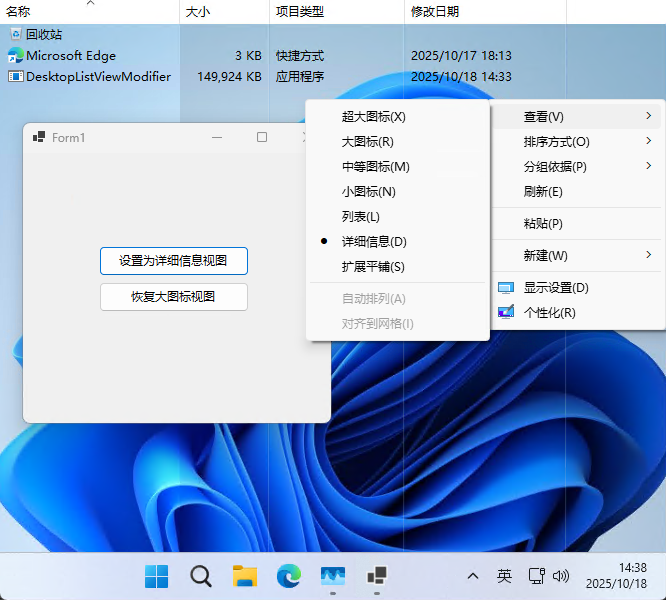

# DesktopListViewModifier

## 语言
- [中文](README.md) - 中文版README
- [English](README_EN.md) - English version README

一个用于修改Windows桌面图标视图模式的工具，可以将桌面图标切换为详细信息视图，并支持恢复默认的大图标视图。

## 功能特点

- ✅ 将桌面图标视图切换为详细信息模式，方便查看文件详情
- ✅ 一键恢复桌面图标为默认大图标视图
- ✅ 设置桌面文字颜色为白色（适用于黑色背景）
- ✅ 设置桌面文字颜色为黑色（适用于浅色背景）
- ✅ 通过重启资源管理器确保设置立即生效
- ✅ 支持Windows 10/11系统
- ✅ 简洁的用户界面，操作直观
- ✅ 文字颜色设置自动保存并在重启后保持

## 界面预览

### Windows 11 右键菜单


### 经典右键菜单


应用程序提供了四个功能按钮：
- **设置为详细信息视图** - 将桌面图标排列方式切换为详细信息模式
- **恢复大图标视图** - 将桌面图标恢复为系统默认的大图标显示方式
- **设置文字为白色（黑背景）** - 将桌面图标文字颜色设置为白色，适用于黑色桌面背景
- **设置文字为黑色（浅色背景）** - 将桌面图标文字颜色设置为黑色，适用于浅色桌面背景

## 使用方法

1. 下载或编译程序
2. 以管理员权限运行程序（Windows需要管理员权限才能修改注册表和重启资源管理器）
3. 点击相应按钮进行视图切换或颜色设置
4. 程序会提示重启资源管理器以应用更改，请确认操作
5. 资源管理器重启后，您可以看到设置已生效

### 文字颜色设置注意事项：
- 点击"设置文字为白色"或"设置文字为黑色"按钮后，程序会提示重启资源管理器
- 确认重启后，桌面图标文字颜色将立即更新
- 颜色设置会保存在注册表中，即使重启系统也会保持

## 技术原理

本工具通过修改Windows注册表设置并重启资源管理器来实现功能：

1. **视图模式修改**：
   - 修改注册表中`Software\Microsoft\Windows\Shell\Bags\1\Desktop`路径下的`FFlags`值
   - 使用预定义的值来设置详细信息视图或大图标视图
   - 重启资源管理器以应用更改

2. **文字颜色设置**：
   - 修改注册表中`Software\Microsoft\Windows\CurrentVersion\Explorer\Advanced`路径下的自定义值
   - 保存颜色设置，以便在程序重启时自动应用
   - 通过用户确认后重启资源管理器使颜色设置生效

3. **持久化机制**：
   - 所有设置都保存在Windows注册表中
   - 程序启动时会尝试读取并应用已保存的设置
   - 重启资源管理器确保设置立即生效并保持

## 编译说明

### 环境要求

- [.NET 8.0 SDK 或更高版本](https://dotnet.microsoft.com/zh-cn/download/dotnet/8.0)
- Visual Studio 2022 或兼容的IDE
- Windows操作系统

### 编译步骤

1. 克隆或下载项目代码
2. 打开`DesktopListViewModifier.sln`解决方案文件
3. 选择目标平台（x86或x64）
4. 构建解决方案（Build Solution）

### 命令行编译

```bash
# 进入项目目录
cd DesktopListViewModifier

# 编译项目
dotnet build -c Release

# 发布项目（可选）
dotnet publish -c Release -r win-x64 --self-contained true
```

## 注意事项

- 某些Windows版本或个性化设置可能会影响工具的效果
- 程序需要以足够的权限运行才能修改桌面设置
- 桌面视图模式更改可能在某些系统操作后自动恢复
- 效果可能因不同Windows版本而略有差异

## 视图持久化解决方案

✅ **持久化问题解决方法**：通过手动右键设置详细信息显示可以确保设置在重启资源管理器和系统后保持不变。

### 设置步骤：
1. 在桌面空白处右键点击
2. 选择「查看」→「详细信息」
3. 这样设置后，即使重启资源管理器或系统，桌面视图也会保持为详细信息模式

## 许可证

本项目为开源软件，仅供个人学习和研究使用。

## 免责声明

使用本工具时请谨慎操作。作者不对因使用本工具导致的任何系统问题或数据丢失负责。请在使用前备份重要数据。