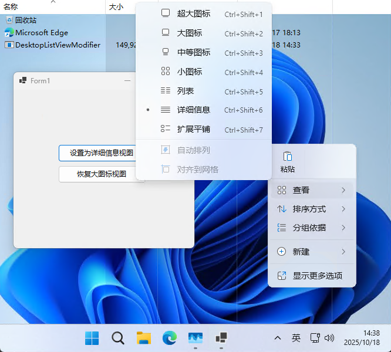
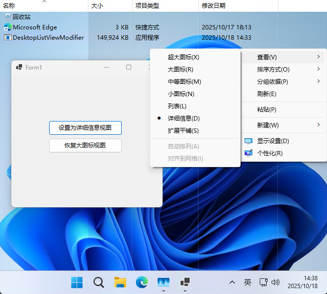

# DesktopListViewModifier

A Windows desktop icon view modifier tool that allows you to easily switch between different desktop views (Details view and Large icons view).

## Language
- [中文](README.md) - 中文版README
- [English](README_EN.md) - English version README

## Features

✅ **View Switching**: Quickly switch between Details view and Large icons view with one click
✅ **Text Color Customization**: Set desktop text color to white (for dark backgrounds) or black (for light backgrounds)
✅ **Immediate Application**: Ensures settings take effect immediately through Explorer restart
✅ **Explorer Restart**: Automatically restarts Windows Explorer to apply view changes
✅ **Registry Backup**: Backs up and restores desktop view settings and text color preferences
✅ **Admin Support**: Includes administrator privilege handling for system-level modifications
✅ **Persistence**: Text color settings are automatically saved and persist after system restart

## Screenshots

### Windows 11 Context Menu


### Classic Context Menu


## Usage

1. Download the latest release from the [Releases](https://github.com/thiswod/DesktopListViewModifier/releases) page
2. Run the program with administrator privileges (Windows requires admin rights to modify registry and restart Explorer)
3. Click the "Set Details View" button to switch to Details view
4. Click the "Set Large Icons View" button to switch to Large icons view
5. Click the "Set Text to White (for Dark Backgrounds)" button to change desktop text color to white
6. Click the "Set Text to Black (for Light Backgrounds)" button to change desktop text color to black
7. When prompted, confirm restarting Windows Explorer to apply the changes
8. After Explorer restarts, you will see the settings have taken effect

### Text Color Setting Notes:
- After clicking "Set Text to White" or "Set Text to Black" buttons, the program will prompt to restart Explorer
- Confirm the restart and the desktop icon text color will update immediately
- Color settings are saved in the registry and will persist even after system restarts

## Technical Implementation

This tool modifies desktop settings by changing Windows Registry values and restarting Explorer to apply changes:

1. **View Mode Modification**:
   - Modifies the `FFlags` value in `Software\Microsoft\Windows\Shell\Bags\1\Desktop` registry path
   - Uses predefined values to set Details view or Large icons view
   - Restarts Explorer to apply changes immediately

2. **Text Color Settings**:
   - Modifies custom values in `Software\Microsoft\Windows\CurrentVersion\Explorer\Advanced` registry path
   - Saves color settings for automatic application when the program restarts
   - Restarts Explorer after user confirmation to make color settings take effect

3. **Persistence Mechanism**:
   - All settings are stored in the Windows Registry
   - The program attempts to read and apply saved settings on startup
   - Explorer restart ensures settings take effect immediately and persist

## Compilation Instructions

### Prerequisites
- .NET 8.0 SDK
- Visual Studio 2022 or later (recommended)

### Command Line Compilation

```bash
# Restore dependencies
dotnet restore

# Build the project
dotnet build --configuration Release

# Publish the application
dotnet publish -c Release -r win-x64 --self-contained true
```

### Building with Visual Studio
1. Open DesktopListViewModifier.sln in Visual Studio
2. Set the build configuration to Release
3. Select Build > Build Solution

## Notes

- This tool modifies system-level settings and may trigger Windows security warnings
- Effects may vary slightly across different Windows versions
- Windows 11 and Windows 10 are officially supported

## View Persistence Solution

✅ **Persistence Solution**: Setting Details view manually via right-click ensures the setting persists after Explorer restarts and system reboots.

### Setting Steps:
1. Right-click on an empty area of the desktop
2. Select "View" → "Details"
3. After this setting, the desktop view will remain in Details mode even after Explorer restarts or system reboots

## License

This project is licensed under the MIT License - see the [LICENSE](LICENSE) file for details.

## Disclaimer

This tool is provided as-is without any warranty. Use at your own risk. The author is not responsible for any system damage or data loss caused by using this tool.